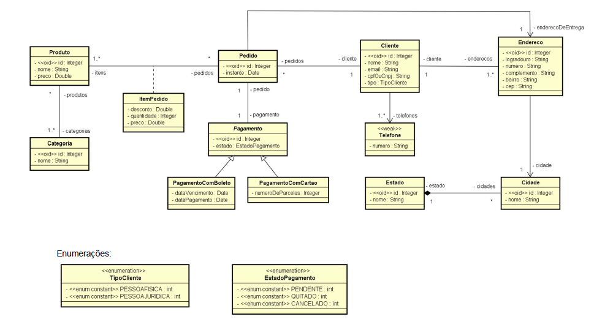
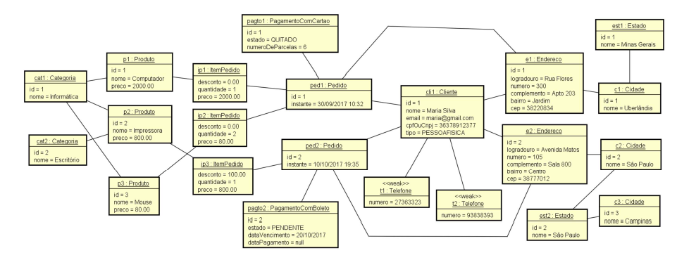
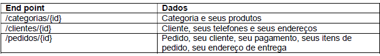

# Curso Spring-boot

Um dos projetos apresentados durante o curso para fixação de conhecimento, nele criamos uma API com Spring e utilizamos o banco de dados H2; 

# Projeto 

<strong>Diagrama utilizado para construção de API </strong>

<strong>Instancias</strong>

<strong>End Points </strong>

